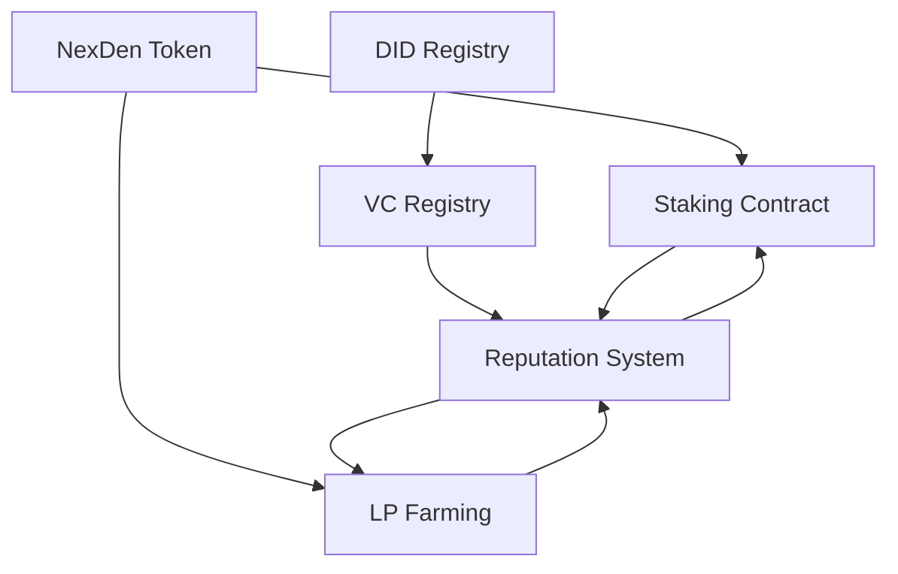

# NexDentify Smart Contracts

This directory contains the Algorand TypeScript smart contracts for the NexDentify decentralized identity platform.

## Overview

NexDentify is built on a suite of interconnected smart contracts that provide:

- **Decentralized Identity (DID) Management**
- **Verifiable Credentials (VC) Registry**
- **Reputation System with Community Attestations**
- **Token Economics with Staking and Farming**
- **Cross-platform Integration and Governance**

## Contract Architecture

### 1. NexDen Token (`nexden-token.ts`)
- **Purpose**: ASA (Algorand Standard Asset) for the NEXDEN utility token
- **Features**:
  - Standard ERC-20-like functionality
  - Minting/burning capabilities for authorized addresses
  - Reward pool management for staking
  - Governance token functionality
  - Integration with staking and farming contracts

### 2. DID Registry (`did-registry.ts`)
- **Purpose**: Manages decentralized identifiers on Algorand
- **Features**:
  - DID creation, updating, and resolution
  - Controller and delegate management
  - Service endpoint registration
  - DID document anchoring (IPFS integration)
  - Ownership transfer and deactivation

### 3. Verifiable Credentials Registry (`vc-registry.ts`)
- **Purpose**: Anchors VC hashes on-chain for verification
- **Features**:
  - Credential issuance and verification
  - Trusted issuer management
  - Credential revocation
  - Batch verification support
  - Integration with reputation system

### 4. Reputation System (`reputation-system.ts`)
- **Purpose**: Calculates and manages user reputation scores
- **Features**:
  - Multi-factor reputation calculation
  - Community attestations
  - Reputation badges and achievements
  - Time-based decay mechanisms
  - Integration with all other contracts

### 5. Staking Contract (`staking-contract.ts`)
- **Purpose**: NEXDEN token staking with multiple pools
- **Features**:
  - Multiple staking pools with different terms
  - Flexible and locked staking options
  - Reputation-based reward bonuses
  - Auto-compounding mechanisms
  - Emergency withdrawal functions

### 6. LP Farming Contract (`lp-farming.ts`)
- **Purpose**: Liquidity provider token farming
- **Features**:
  - Multiple farming pools
  - Time-based reward distribution
  - Reputation multipliers
  - Farm lifecycle management
  - Emergency controls

## Contract Interactions



## Key Features

### 🔐 **Security**
- Multi-signature admin controls
- Emergency pause mechanisms
- Reentrancy protection
- Input validation and sanitization
- Time-lock mechanisms for critical operations

### 🏗️ **Modularity**
- Loosely coupled contract architecture
- Upgradeable proxy patterns
- Cross-contract communication
- Event-driven updates
- Plugin-style integrations

### ⚡ **Performance**
- Optimized for Algorand's consensus
- Batch operations support
- Efficient state management
- Gas-optimized algorithms
- Minimal on-chain storage

### 🌐 **Interoperability**
- Standard DID/VC compliance
- Cross-chain bridge ready
- API-friendly interfaces
- Event emission for indexing
- Integration hooks for dApps

## Deployment

### Prerequisites
```bash
npm install @algorandfoundation/tealscript
npm install @algorandfoundation/algokit-utils
```

### Configuration
1. Copy and modify the deployment configuration:
```typescript
import { testnetConfig, mainnetConfig } from './deployment-config';
```

2. Set up your Algorand node connection and accounts

3. Deploy contracts in the correct order:
```typescript
const manager = new DeploymentManager(testnetConfig);
const deployedContracts = await manager.deployAll();
```

### Deployment Order
1. **NexDen Token** (ASA creation)
2. **DID Registry** (independent)
3. **VC Registry** (requires DID Registry)
4. **Reputation System** (requires DID + VC Registry)
5. **Staking Contract** (requires Token + Reputation)
6. **LP Farming** (requires Token + Reputation)

## Usage Examples

### Creating a DID
```typescript
// Create a new DID
const didId = await didRegistry.createDID(
  'did:algo:testnet:7ZUECA7HFLZTXENRV24SHLU4AVPUTMTTDUFUBNBD64C73F3UHRTHAIOF6Q',
  'ipfs://QmYourDIDDocument',
  'controller1,controller2',
  '{"service": [{"type": "IdentityHub", "endpoint": "https://hub.example.com"}]}'
);
```

### Issuing a Verifiable Credential
```typescript
// Issue a credential
await vcRegistry.issueCredential(
  'credential-id-123',
  'sha256-hash-of-credential',
  userAddress,
  'UniversityDegree',
  'https://schema.org/EducationalCredential',
  expirationTimestamp,
  '{"university": "MIT", "degree": "Computer Science"}'
);
```

### Staking Tokens
```typescript
// Stake in a pool
await stakingContract.stake(
  poolId,
  stakeAmount
);

// Claim rewards
await stakingContract.claimRewards(poolId);
```

### Creating Attestations
```typescript
// Attest to someone's reputation
const attestationId = await reputationSystem.createAttestation(
  subjectAddress,
  attestationWeight,
  '{"type": "professional_endorsement", "skill": "blockchain_development"}'
);
```

## Testing

### Unit Tests
```bash
npm run test:unit
```

### Integration Tests
```bash
npm run test:integration
```

### Testnet Deployment
```bash
npm run deploy:testnet
```

## Security Considerations

### 🛡️ **Access Control**
- Role-based permissions
- Multi-signature requirements
- Time-locked admin functions
- Emergency pause mechanisms

### 🔍 **Validation**
- Input sanitization
- State consistency checks
- Overflow/underflow protection
- Reentrancy guards

### 🚨 **Emergency Procedures**
- Circuit breakers
- Emergency withdrawal
- Admin override capabilities
- Incident response protocols

## Gas Optimization

### 📊 **Storage Efficiency**
- Packed data structures
- Minimal state variables
- Efficient key naming
- Batch operations

### ⚙️ **Computation Optimization**
- Algorithmic efficiency
- Lazy evaluation
- Caching mechanisms
- Off-chain computation where possible

## Monitoring and Analytics

### 📈 **Key Metrics**
- Total Value Locked (TVL)
- Active users and DIDs
- Credential issuance rates
- Reputation score distributions
- Staking participation

### 🔔 **Alerts**
- Unusual transaction patterns
- Large withdrawals
- Contract errors
- Performance degradation

## Roadmap

### 🚀 **Phase 1** (Current)
- ✅ Core contract deployment
- ✅ Basic DID/VC functionality
- ✅ Simple staking mechanisms
- ✅ Reputation calculation

### 🌟 **Phase 2** (Q2 2024)
- 🔄 Cross-chain bridges
- 🏛️ Governance mechanisms
- 📱 Mobile SDK integration
- 🔐 Advanced privacy features

### 🌍 **Phase 3** (Q3 2024)
- 🤝 Enterprise integrations
- 🎯 Advanced reputation algorithms
- 🔗 DeFi protocol partnerships
- 📊 Analytics dashboard

## Contributing

1. Fork the repository
2. Create a feature branch
3. Write tests for new functionality
4. Ensure all tests pass
5. Submit a pull request

## License

MIT License - see LICENSE file for details

## Support

- 📧 Email: dev@nexdentify.com
- 💬 Discord: [NexDentify Community](https://discord.gg/nexdentify)
- 📖 Documentation: [docs.nexdentify.com](https://docs.nexdentify.com)
- 🐛 Issues: [GitHub Issues](https://github.com/nexdentify/contracts/issues)